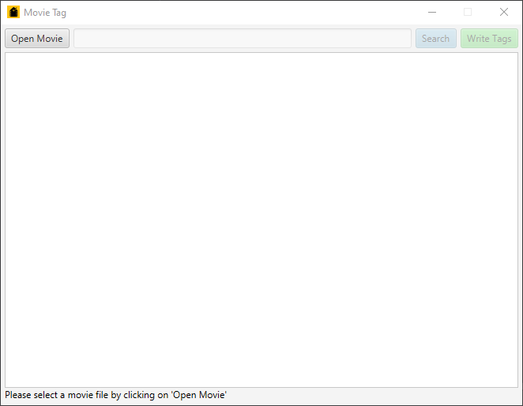
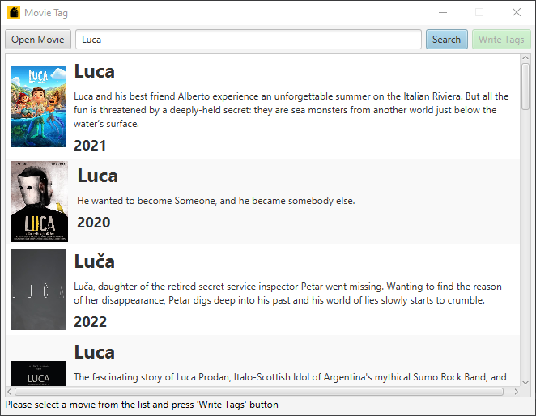
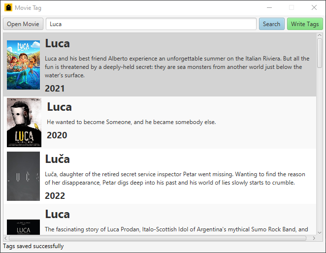

# Movie Tag

A JavaFX application that write tags and cover art images in mp4 and mkv video files.
It uses the [JSON API](http://api.themoviedb.org/) provided by [TMDb](https://www.themoviedb.org/).

## Screenshots





## Build

In order to build the project you need [IntelliJ IDEA](https://www.jetbrains.com/idea/).
Clone the repository and open the project with IntelliJ.

Then in `MovieTag -> src -> main -> resources` folder create a `tmdb.properties` file with the following content

```
KEY=YOUR_KEY_FOR_TMDB_API
```

and replace `YOUR_KEY_FOR_TMDB_API` with your key from [TMDb API](http://api.themoviedb.org/).

Then you can run the project or generate native bundle and JAR files.

## Libraries Used

-   [JCodec](http://jcodec.org/docs/working_with_mp4_metadata.html) used for editing metadata of mp4 files.
-   [themoviedbapi](https://github.com/c-eg/themoviedbapi) used to access the TMDb API.
